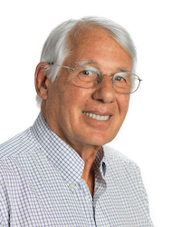
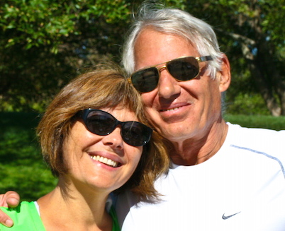

I entered the University of California at Berkeley as a physics major in 1965. In 1968 U.C. Berkeley established a Computer Science Department in the College of Letters and Science. I graduated with a Bachelor of Arts in Computer Science in 1969. I worked at Stanford Research Institue in Doug Engelbart's group which pioneered using the computer to augment human intelligence SRI was the second node on the ARPA network. I worked at Xerox Palo Alto Research center which pioneered the graphical user interface, and local area networks. I joined the personal computer revolution in 1982 by purchasing an Atari 800 home computer with 48KB of memory and a 5.25" floppy drive with a storage capacity of 88KB. Using the Atari as a FORTH language development system, I wrote a abstract strategy game based on a Martin Gardner column from Scientific American Magazine. Electronic Arts published the game, Worms?, and hired me and my good friend from Xerox, Steve Hayes, as the first two software engineers at Electronic Arts. At Electronic Arts we helped bring about the computer entertainment revolution. After EA I worked at Silicon Graphics, advancing the 3D computer revolution. Later, at Google, I helped advance the mobile revolution by managing the Google Maps for Mobile Application on the Blackberry platform. At Box Inc., I helped advance the cloud revolution by managing their mobile applications. In 2017 I was the first person to ever retire from Box Inc.
I graduated from UC Berkeley with a BA in Computer Science in 1969, only the second year that degree was offered at Berkeley.

I have had a wonderful career as a software engineer, a software artist and an engineering manager in Silicon Valley. I have been in the right places at the right times to watch and participate in many computer revolutions. I have had the opportunity to work in some truly remarkable organizations with some amazingly talented and visionary people. I am creating this blog in order to record some of my experiences during this journey, and as my journey of learning and discovery continues through retirement.

I plan to record in this blog some of the Silicon Valley history I have witnessed, and tell stories about some of the incredible computer programmers I have met. I will also share some of my amateur photography.

### Around the web

- Email: [davidsmaynard AT gmail DOT com](mailto:davidsmaynard@gmail.com)
- GitHub: [dmaynard](https://github.com/dmaynard)
- Twitter: [dsmaynard](https://twitter.com/dsmaynard)
- LinkedIn: [David Maynard](https://linkedin.com/in/davidsmaynard)

## Family

I have been married to my beautiful and talented wife Sally for 36 years.
I have 3 kids, Jordan, Phil, and Dana. All three are alumni of Electronic Arts, and my two sons are still very active in the game industry at [Manticore Games](https://www.manticoregames.com/)

## Links

A non-exhaustive list.

- [Douglas Engelbart](http://dougengelbart.org/) – a visionary I had the honor of working for
- [Bill Duvall](https://www.youtube.com/watch?v=MKwQ2jFETaQ) – Brilliant programmer, software pioneer, mentor, pilot
- [Bill English](<https://en.wikipedia.org/wiki/Bill_English_(computer_engineer)>) Co-inventor of the mouse, mentor, first CFO of Unicode Consortium.
- [Tania Rascia](http://taniarascia.com/) – wonderful front end tutorials from a brilliant self-taught front end developer
- [Trip Hawkins](https://tmp.ucsb.edu/about/people/trip-hawkins) – Three start-ups with Trip taught me invaluable lessons.
- [Aaron Levy](https://en.wikipedia.org/wiki/Aaron_Levie) Co-founder and CEO of Box. Brilliant, passionate and funny

## Timeline

- **1947** – Born in Burbank, CA, to a Lockheed Engineer and his British bride. One older sister
- **1952** - Enter Kindergarten in January because the LA Unified School District had split year classes
- **1962** – Attend Van Nuys High School where the [father of the internet](https://en.wikipedia.org/wiki/Vint_Cerf) claims the [internet was conceived](https://peoplecentered.net/2017/03/15/vint-cerf-at-sxsw-2017/)
- **1964** – December 3, in the largest mass arrest in U.S. History 800 students and protesters are arrested as part of a Free Speech Protest on the Berkeley Campus.
- **1965** – January. I graduate high school on a Friday night and start classes in Berkeley on Monday as a freshman majoring in Physics
- **1966** - March. My introduction (for \$1.50) to both Anti-Vietnam-War protests, and the psychedelic music scene in the Bay Area
  
- **1968** – Summer job as a Computer Operator at Lockheed Burbank on an [IBM 360/91](https://en.wikipedia.org/wiki/IBM_System/360_Model_91).
- **1968** – Changed my major from Physics to Computer Science
- **1968** - Wrote my first non-trivial computer program. I taught myself LISP from the [LISP 1.5 Programmers Manual](http://www.softwarepreservation.org/projects/LISP/book/LISP%201.5%20Programmers%20Manual.pdf).I then wrote a predicate calculus theorem prover in LISP on punched cards. It ran in batch mode on the UC Berkeley CDC-6400 Mainframe. The Lisp implementation was written at the University of Texas and loaded from 9-Track tape for each execution. Turn around time from deck submission to printed output was between 2 and 24 hours. After this, programming on any platform in any language was easy (at least easier)
- **1969** – Graduated from UC Berkeley with a BA in Computer Science. I had three career choices... Get drafted to fight in Vietnam, flee the country to Canada, work for Lockheed. I choose Lockheed.
- **1970** – Transfer to Lockheed Palmdale to work on commercial project, flight test software for the [Lockheed L-1011](https://en.wikipedia.org/wiki/Lockheed_L-1011_TriStar)
- **1971** – Begin Masters program at USC in Computer Science, working full-time and commuting from Palmdale to USC, downtown LA
- **1972** – Receive 1H Draft Deferment. Received Master's Degree. Quit Lockheed, move back to Bay Area to look for a job.
- **1972** – Got hired at Stanford Research Institute writing Algol code on a [Burroughs B-5500](https://sky-visions.com/burroughs/) computer in support of the Head Start program. The B-5500 was way ahead of its time. The time sharing OS was written in Algol and had one process for user interaction, and one for background tasks. They were called bump and grind respectively. The B-5500 mainframe also had a Nixie tube display which displayed the instruction counter of the cpu in real-time. How cool is that?
- **1973** – Transferred to [Doug Engelbart's](<(http://dougengelbart.org/)>) Augmentation Research Center at SRI. This was less than five years after the [Mother of All Demos]().
- **1974** – Watched as Kirk Kelley created a demo as part of a proposal of a system he called the [Whole Universe Catalog](https://searchworks.stanford.edu/view/12255791). This demo, created using NLS, presaged the Internet, Ebay, Wikipedia, and Google, all in 1974. Watch the video if you don't believe me. The project of course was never funded because it was "too far out".
- **1975** - On February 21, my oldest son, Jordan, is born. I announce his birth with a Journal EMail Entry using the NLS system.
- **1976** - Doing systems programming on the NLS system using the L-10 Language, custom built at SRI using YACC and Lex to program the PDP-10 which ran the NLS system. After about 10pm at night NLS was a better code editor the I can find today. After 10pm because the machine was time shared, and the 'load average' went down. Better editor mainly because the extensive use of the mouse along with the [keyset](http://www.dougengelbart.org/content/view/273/309/), and hierarchical 'viewspecs'
- **1976** - Wrote the typesetting code using TROFF for one of the first ARPA Net Directories. A white pages type book of all ARPA net users.
- **1977** - Wrote what I claim was the world's first web crawler program. The was implemented as a 'viewspec' in NLS (W) that recursively expanded links in the NLS hypertext system. This combined with the NLS's build in search filter essentially implemented a web crawler.
- **1977** - Doug's Group at SRI was being spun-off to Tymshare (McDonnel Douglas). I was offered a job at Xerox PARC and eagerly accepted.
- **1977** - At Xerox PARC I got my own office, and my own [Xerox Alto](https://www.computerhistory.org/revolution/input-output/14/347), the world's first networked, bitmapped display personal computer.
- **1978** - I was a recipient of the [world's first spam email](https://www.templetons.com/brad/spamreact.html)
- **1978** – I was part of a small team that developed JDS, the worlds first Japanese Word Processor with kana => kanji conversion and graphical display. This was developed on the ALTO jointly by Xerox and Fuji Xerox as a demonstration prototype which successfully led to the inclusion of Japanese Language capabilities in the Xerox Star 810 product. Dr. Joseph Becker and Bill English later played major roles in the development of the Unicode Standard.
- **1979** - The home computer revolution begins for me. I and four friends form a DBA company "Sandbox Systems" to buy a [Northstar Horizon](https://en.wikipedia.org/wiki/North_Star_Horizon) Z-80 system with an S-100 Bus and built in dual 5.25 inch floppies. Purchase price was around \$2,000. The system runs CPM and we ran UCSB Pascal on it.
- **1981** - I purchased an Atari-800 with 48kb of RAM and one Atari 810 floppy drive. 5.25" floppies help 90KB of data. Cost ~ \$2,000.
- **1982** – JDS project got folded into the Star project and I get transferred from Xerox PARC (Consulair actually) to Xerox System Development Department.
- **1982** - I wrote the first version of Worms? at home, using the Atari 800 and the Forth Language. It took me about six months to write the game, and about six months to get official release from Xerox Corporate that they were not interested in claiming any rights to my side project.
- **1982** - I went looking for a games publisher. Electronic Arts was just starting up and they offered to publish my game and also gave me a job offer as a software engineer which I eagerly accepted. Steve Hayes, also from Xerox SDD, and I became the first two software engineers hired by Electronic Arts. This was December of 1982.
- **1982 - 1989** Electronic Arts. Technical Director. Worked with great people and great programmers on great games. [M.U.L.E.](http://www.geekometry.com/2013/11/gamechanger-m-u-l-e/), [Seven Cities of Gold](<https://en.wikipedia.org/wiki/The_Seven_Cities_of_Gold_(video_game)>), [Starflight](https://arstechnica.com/gaming/2012/09/masterpiece-starflight-for-pc/), [Modem Wars](https://en.wikipedia.org/wiki/Modem_Wars), [Earl Weaver Baseball](https://en.wikipedia.org/wiki/Earl_Weaver_Baseball) and many more.
- **1989** - Joined Silicon Graphics to help add multi-media to the Indigo Product.
- **1992-1999** – The 3DO Company. Software Director, build development tools environment on the Mac for the 3DO machine.
- **2000** - Firetalk Communications. Internet based voice chat platform
- **2001 - 2003** - The 3DO Company
- **2003 - 2005** - Digital Chocolate Mobile Gaming on Brew and J2ME platforms.
- **2006 - 2009** - Google. Managed Google Maps for Mobile group during explosive growth on Blackberry platform
- **2010 - 2011** - Total Immersion Software. Wrote an Android app worn by bomb detection dogs to help train dog trainers. It recorded GPS and Dogs posture for replay in simulated war zones.
- **2011 - 2017** - Box Inc. Manager of Mobile Applications. Managed iOS and Android application development for the Box cloud Content Management System.
- **2017 - Present** - Retired, but still learning new things and still hacking code.

## Currently Using

- **Computer:** MacBook Pro 2015
- **Hosting:** [Netlify](https://netlify.com)
- **Editor:** [Atom](https://code.atom.io/)
- **Static site generator (blog):** [Gatsby](https://gatsbyjs.org)
- **Code syntax theme:** [New Moon](https://taniarascia.github.io/new-moon)
