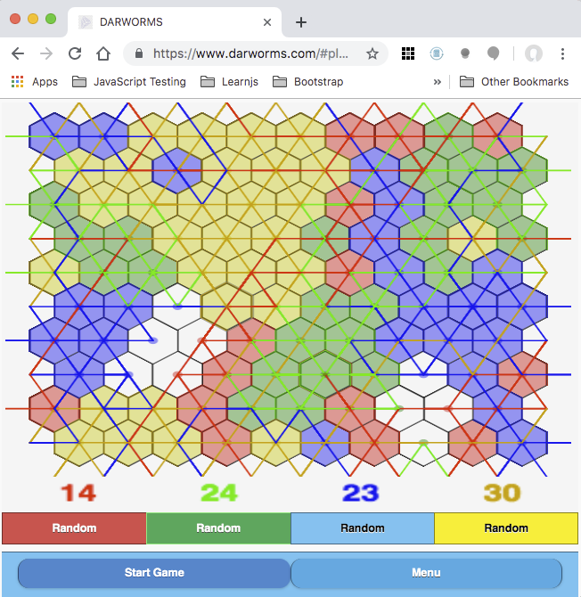

## What
I am launching [Darworms](https://darworms.com), a web based port of the games [*Worms?*](https://en.wikipedia.org/wiki/Worms%3F) which I wrote in 1982 on an Atari 800 and was published as a launch title by ELectronic Arts in May of 1983. Darworms is a one to four player strategy game of territory capture.

## Why
Why would anyone want to spend time recreating a 36 year old video game that was a relative commercial flop when it shipped even with a massive Electronic Arts [ad campaign](https://www.eurogamer.net/articles/2018-09-16-seeing-farther-the-advert-that-changed-the-games-industry) behind the launch titles?
* For fun and, alas, probably *not* for profit
* I like to code, I really do
* I retired in 2017
* I wanted to learn front-end devvelopment, JavaScript (ES6), modern frontend development practices, HTML 5 and canvas graphics
* I am intrigued by the existence of the browser platform which offers the potential of frictionless distribution to literally billions of people.
* I wanted a project that might enable meaningful comparisons between the 1980's and now for software development, user platforms, software distribution, and software marketing.
* Even though I know the game will not appeal to all audiences, I also know from experience a small subset of the audience (hello geeks and nerds) will find the game fascinating.  The original *Worms?* had a small but dedicated cult following.
* I want to see if a being "Software Artist" is a viable goal today. it was possible for a one man shop to create, publish, distribute and market a casual game
* I still find the game interesting.  For example even though the game is entirely deterministic, I have no idea whether the player who moves first in a two player game has an advantage.

## How
Darworms is implemented as a single page application. It is written in a modern version of JavaScript called ECMA Script 6 or simply ES6.  It uses an application framework called [JQuery Mobile](https://jquerymobile.com/) which is built on top of [JQuery](https://jquery.com/).
I developed Darworms using my 15" MacBook Pro with 16MB of RAM. I stated out using Webstorm as an IDE but switched to [Atom](https://atom.io). [Github](https://github.com/dmaynard/Darworms) is used for source control. Deployment to darworms.com and serving darworms.com is done by [Netlify](https:netlify.com) which is amazing and wonderful.
