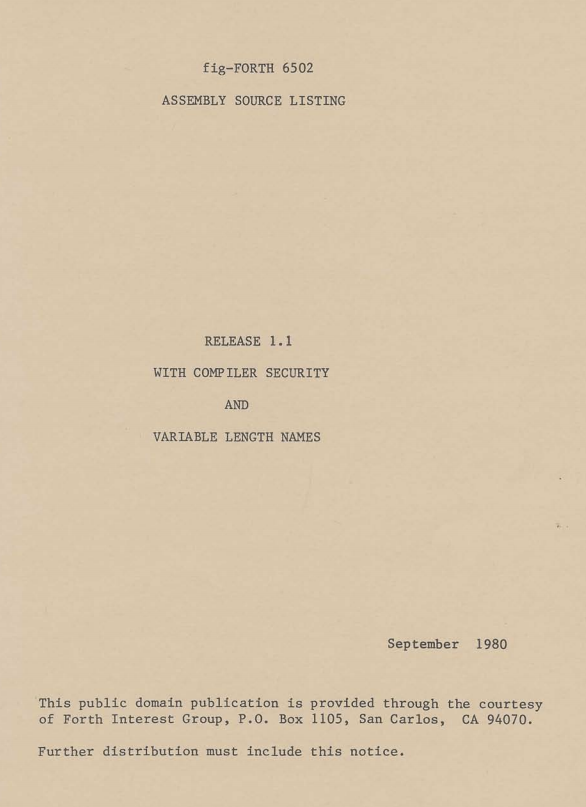
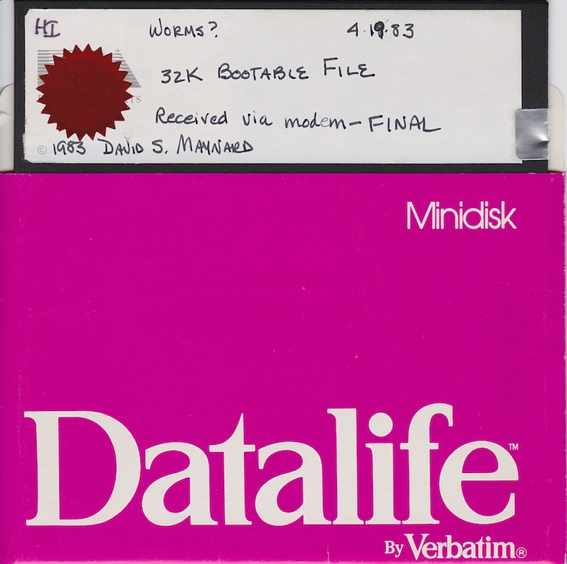
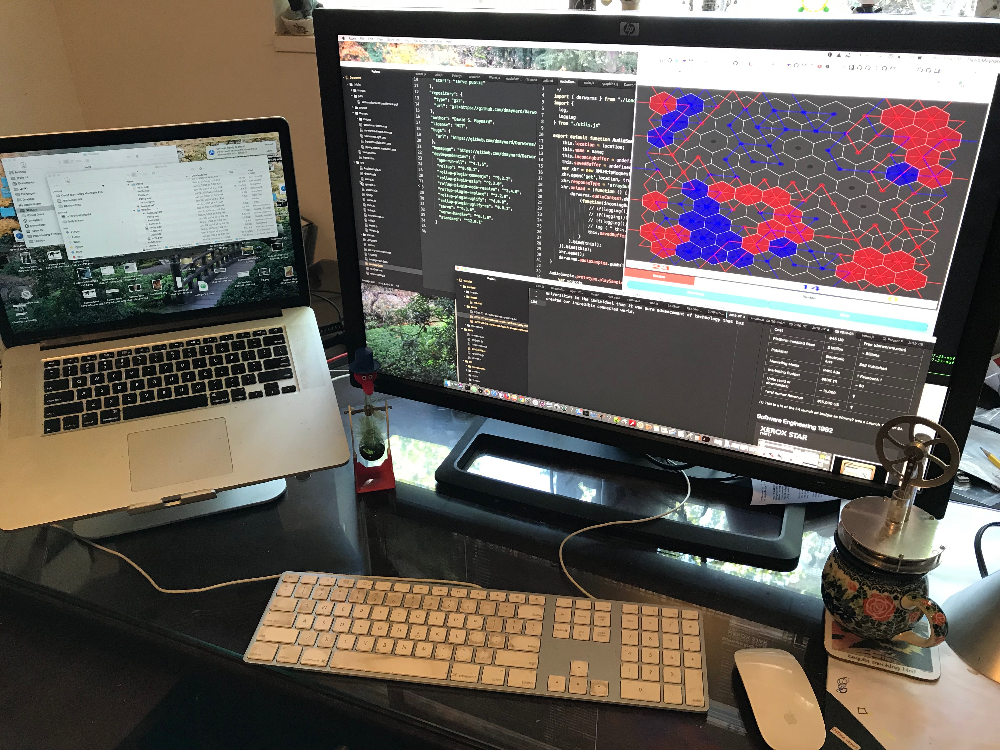
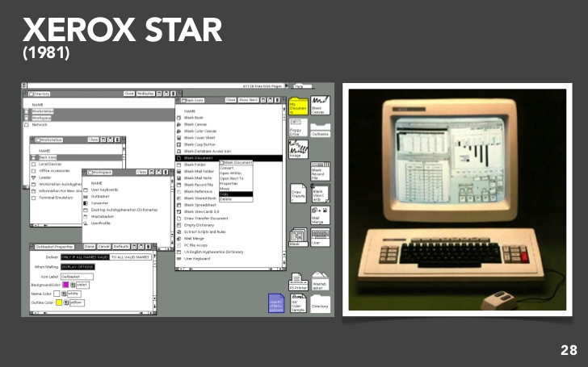
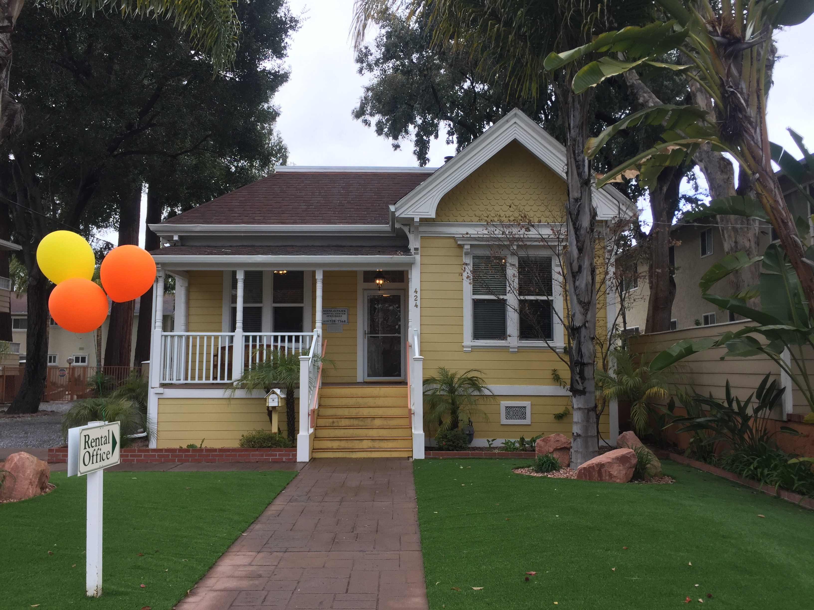

I started working on the first version of this game in 1981 when I bought my first home computer, an Atari 800 with 48KB of Ram and one Atari 810 Disk Drive.  I was working at Xerox Systems Development Department on the [Xerox Star System](https://en.wikipedia.org/wiki/Xerox_Star).  Since I was working full time I programmed "Sumo Worms" (My original name for the game) moonlighting in the evenings and on weekends. I was aware of the fact that some technology companies had tried to claim ownership of code written by employees on their own time.  As a result I was careful to do all the work on the game on my own time and on my own equipment. When I had demo-able version I formally requested a release from Xerox for the Intellectual Property rights to the game. Several months later I received an official letter from the corporate lawyers at Xerox Corporate Office in Rochester NY acknowledging the fact that Xerox had no interest in bringing this to market. I still have a copy of this letter.  In this post I will compare the software development environment of a software artist in 1982 versus today.  I will also compare my engineering software development environment of 1982 versus today.   Surprisingly I find that the gap between the engineering environment and artist environment in 1982 was greater than the gap between engineering environments between 1982 and today.

## Software Artist's Studio 1982

At home was a totally different story! An [Atari 800](https://en.wikipedia.org/wiki/Atari_8-bit_family), with a 1.79 MHZ 6502 8 bit processor with 48KB RAM - ($1500) + an Atari 810, a 90KB single sided single density disk drive ($500), a 300 baud acoustic modem connected through an external [serial port adapter](http://www.atarimania.com/faq-atari-400-800-xl-xe-what-is-the-atari-850-interface-module_52.html) . No mouse, no disk operating system, no file system. The system was primitive, but **MINE**.  For the first time, I, as a software artist, did not need a patron to provide me a computer to play on. Revolutionary! The beginning of the home computer revolution for me.

How should I program the Atari 800?  Basic was out of the question both for performance, memory, and sanity considerations.  The high level languages at Xerox had spoiled me enough that I was reluctant to program totally is 6502 Assembler (I know, I'm a wimp). There was no C compiler for the Atari, what to do?  An astronomer, and Bill Ragsdale and the birth of the open source movement, saved me.  The astronomer was [Charles Moore](https://en.wikipedia.org/wiki/Charles_H._Moore) who invented the [FORTH](https://en.wikipedia.org/wiki/Forth_(programming_language)) language in 1968. Forth is a threaded, interpreted, extensible language with remarkable compactness. The next hero in my story is Bill Ragsdale.  I claim Bill Ragsdale started the open source software movement! Three years before Richard Stallman started the Free Software Movement Ragsdale [published his implementation](http://www.forth.org/fig-forth/fig-forth_6502.pdf) of Forth for the 6502 called fig-Forth. This was in placed in the public domain in September of 1980.

I got my copy of this document at a [home brew computer club meeting](https://en.wikipedia.org/wiki/Homebrew_Computer_Club) in Menlo Park, CA where I lived.  Menlo Park was also home to the [People's Computer Company](http://www.digibarn.com/collections/newsletters/peoples-computer/index.html) an community computer center, founded in the 1970s that published a "Tiny Basic". The People's Computer Company published the first version in a separate newsletter format known as the "Tiny BASIC Journal", or in its full name, "Dr. Dobb's Tiny BASIC Journal: Calisthenics & Orthodontia, Running Light Without Overbyte". Later it became known as simply [Dr. Dobb's Journal](https://en.wikipedia.org/wiki/Dr._Dobb%27s_Journal). Stanford Research Institute, also in Menlo Park, CA, included Doug Engelbart's [Augmentation Research Center (ARC)](https://en.wikipedia.org/wiki/Augmentation_Research_Center).   ARC performed [The Mother of All Demos](https://en.wikipedia.org/wiki/The_Mother_of_All_Demos) in December 1969.
SRI and UCLA were the first two hosts on the ARPA Net. Is it a coincidence that all these were all headquartered in Menlo Park, CA, a city with a population less than 30,000 in 1982?

A fig-forth disk for the Atari 800 and [Chris Crawford's](https://en.wikipedia.org/wiki/Chris_Crawford_(game_designer)) invaluable [De Rey Atari](https://www.atariarchives.org/dere/) book which explained how the Atari Hardware worked were enough to get me started.

The fig-Forth system included, a compiler, an assembler, and editor, and a disk file system in under 16KB of memory. Most of it written in Forth itself.  For example, a complete [6502 assembler](https://atariwiki.org/wiki/Wiki.jsp?page=6502%20Assembler%20in%20Forth) implemented in 96 lines of Forth (also by Bill Ragsdale).  Forth is also an extensible language. Forth can add new keywords to the language at compile time! This feature is powerful, but also makes its possible (almost irresistible) for each programmer to create their own dialect in for a given problem domain.  This makes Forth better suited to Software Artists (single programmer projects) than to Software Engineers (team projects).  This feature also gives Forth a reputation as a write-only language (difficult to read another programmer's code).  Developing Worms? using a 1.79 MHz 8-bit 6502 cpu and 90kb, slow floppy drives was painful, but possible! I think it took about 30 minutes for a full build, swapping source disks and then writing a bootable disk.

When I had a more less completed version of Sumo Worms in the fall of 1982, I started looking for a publisher.  Several companies, including Epyx  declined. Electronic Arts was starting up, and had hired its first VP of Software development, Tim Mott, from Xerox.  Electronic Arts offered to publish the game (including a $15K advance against royalties).  They simultaneously offered me a job as a software engineer.   I accepted both.  Thus Steve Hayes and I, both from Xerox SDD became the first two engineers hired by Electronic Arts in December of 1982.  I was employee number 11.  When I had completed the software EA had me deliver it via file transfer (over a 300 baud acoustic modem) because of some obscure tax code about tangible goods.  Delivering the "work" by modem meant it couldn't possibly be tangible!  I actually still have this "Golden Master" floppy.

This was back in the day when you had to get the software correct **BEFORE** you shipped it.
Game development was possible for an individual software artist in 1982.  Marketing, publishing and distributing software was all but impossible for an individual.  One needed a publisher.  I was lucky that Electronic Arts published my game. I have long suspected that their desire to hire me played a large role in their decision.

## Software Artist Studio Today

This is my artist studio today. A 15" MacBook Pro with 16MB of RAM, a 2500x1600 external LCD monitor. and a fast (170M bps) internet connection.  Darworms is a single page application written in a modern version of JavaScript called ECMA Script 6 or ES6.  It uses application frameworks called [JQuery Mobile](https://jquerymobile.com/) and  [JQuery](https://jquery.com/).
I stated out using Webstorm as an IDE but switched to [Atom](https://atom.io).  I use [Rollup](https://rollupjs.org/guide/en/) as a build, tree-shaking, and packaging tool for ES6 running on top of [Node 10.16.2](https://nodejs.org/en/).  I use the Chrome developer tools for debugging and monitoring network and memory usage. I use [Github](https://github.com/dmaynard/Darworms) for source control. I use [Netlify](https:netlify.com) for deployment tp darworms.com. Netlify is wonderful. I can publish packaged code with one push of a button to a [content delivery network](https://en.wikipedia.org/wiki/Content_delivery_network) which provides worldwide access to billions of potential users.
Today the independent game developer has an embarrassment of riches at her disposal.  For about the price of my Atari 800 with extra memory and disk drives I now have a 15" MacBook Pro, with a 5,000 times faster CPU, and with over 300,000 times more RAM. The amount of information I have immediate access to is has grown at an even faster rate with the development of the internet.  Google, StackOverflow and all the open source project sites create an unbelievable storehouse of information and advice. The complexity of the systems involved has almost kept pace.  In 1982 my entire development environment was 250 KB (three floppies).  Today my Darworms project directory alone is about 100 MB or 400 time larger. Compare the technologies I had to learn to complete the game in each era

### 1982
* Atari Hardware Architecture
* 6502 assembly
* Forth language
* Forth Editor

### Today
* Javascript
* ES 6
* HTML 5
* CSS
* SVG (Canvas Graphics)
* JQuery
* JQuery mobile
* JQuery Mobile Theme Roller
* Ajax
* Web Audio
* Babel
* Roll-up
* Node
* NPM
* NVM
* GitHub
* Netlify
* Atom
* Chrome Developer Tools
* Google Analytics
* Screen Capture and Video Editing

In 1982 I understood every line of the forth code, and knew precisely how to control the hardware of the Atari 800.  Today I experience what I call the Fog of the Framework.  Like a 3D scene that uses fog to reduce the number of polygons to render, my mind can focus on only small portions at a time of the varied myriad frameworks needed to publish a game today.  If I have trouble, I use the magnifying technique and incantations (Google Search and StackOverflow), to zoom in on one small aspect of a given framework until I can solve my problem.  The terrain is so vast that I soon forget the details of that piece of framework until I must revisit the issue. This may be because my memory cache size has shrunk with age. This leaves an unsettling feeling of depending upon mountains of code that one has no idea of how it works.  The amplification of capabilities provided by the frameworks more than makes up for this, but still leaves me with an unsettled feeling.

Here are some comparison metrics between creation of virtually the same game in 1982 and also in 2019:

Item |    1982   |   2019  | Comparison
-----------|-------------|-------------|--------
Platform | Atari 800 | Modern Web Browsers | Access to 90KB floppy vs Access to all the world's knowledge 
Dev CPU   | 1.79 MHz | 2.5 GHz (x4 Cores) | ~ 500 x
Dev RAM  | 48 KB  |  16 GB | 40,000 x
Dev System Cost  |  $2,500 |  $2,500 | ~=
Language | Forth | ES6 | Comparable
Source Code  |  120 KB | 164 KB | ~=
Run Time Code  | 32 KB  |  534 KB | ~ 16 x
Run Time Resources  |  4 KB |  1.6 MB (Audio Samples) | ~ 400 x
Build Time  |  20 Minutes |  1.1 seconds | ~ 18 x
Networking Bandwidth  | 300 baud point to point acoustic modem |  170 Mbs Internet Connection | ~ 60,000 x
Channel  | Retail  |  Single Page Web Application | molasses vs frictionless
Deployment Time  | ~ 6 weeks  |  ~ 6 minutes | ~ 10,000 faster
Customer Feedback Time  | snail mail  | email  |  ~ 4,000 faster
Cost   | $45 US   |  Free (darworms.com) | Free  | 2,000 more
Publisher | Electronic Arts | Self Published | Corporation vs Individual
Marketing Media  |  Print Ads |  ? Facebook ? |  **?**
Marketing Budget | $50K (1) |  ~ $0  |  0 x
Units (sold or downloads)  | ~ 15,000  | **?**
Total Author Revenue  |  $15,000 US |  **?**  |   **?**

(1)  This is a % of the EA launch ad budget as Worms? was a Launch Title for EA

## Software Engineering 1982

What was software development like in 1982? At Xerox, pretty fabulous! High level language - [Mesa](https://en.wikipedia.org/wiki/Mesa_(programming_language)), built-in 10MB hard drive, local area ethernets connected via the ARPANET, network file system, Laser printers, a 1024×809 monochrome bitmapped display, an IDE with built in debugger.  Xerox designed the hardware, the network protocols, and the Mesa language and implemented the compiler and the associated micro-code which enabled the [Amd 2900](https://en.wikipedia.org/wiki/AMD_Am2900) [bit-slice processors](https://en.wikipedia.org/wiki/Bit_slicing) to execute the Mesa Language via a set of well defined byte codes [Mesa Princops](http://www.woodward.org/mps/). Here is an example of how wonderful the software development system was (and a example of how a closed system can react faster than an open system).  The most frequently occurring Mesa op-codes had 8-bit op codes in the virtual machine and less frequently used opcodes used 16-bit op codes.  One weekend the Mesa group,  5 or 6 brilliant engineers,  analyzed the then current code base for the entire Star system.  This was the entire output of about 100 ~ 150 engineers over about two ~ three years of effort. They discovered that some 16 bit opcodes were actually more common than some 8-bit opcodes in the application.  They rearranged the opcode definitions, updated the mesa compilers, and issued new micro-code for the machines.  On Monday morning 200 engineers in Palo Alto and El Segundo all had 20% smaller compiled program sizes and zero source code-changes and zero new bugs introduced. This also improved performance since the system was memory bound.  This was in 1982!  One of the reasons I have read for the commercial failure of the Xerox Star product, was that the development environment was so wonderful that it enabled the engineers and designers to build a system that was 10 years ahead of its time.  I think there is a lot of truth to this.

Software Engineering Environment 1982 vs today

Feature    | Software Engineering Xerox SDD 1982 | Software Engineering Today
-----------|----------------|-------------
Personal Workstation  |  ✅  |  ✅
Mouse   |  ✅ |  ✅
[Keyset](http://www.dougengelbart.org/content/view/273/309/) | ✅   |  ❌
LAN  | ✅  |  ✅
WAN  | ✅   | ✅
Network File System  | ✅  |  ✅
Private Office  | ✅   |  ❌
World Wide Web  | ❌  |   ✅
High Level Programming Languages  |  ✅   |   ✅
Multi-Lingual Support  | ✅  |  ✅
Source level Debugging  | ✅   |  ✅
Laser Printers  |   ✅   |   ✅
Source Control  |  ✅  |  ✅
GUI  | ✅    | ✅
Color Display  |   ❌   |  ✅
Audio Video  | ❌   |  ✅
LAN  | ✅    |  ✅
email  | ✅    |  ✅
Open Source Ecosystem  |  ❌  |  ✅

The biggest difference between being a Software Artist in 1982 and today is transformation of the media from physical to digital.  Duplication and distribution are almost Free.  Billions of users have access. Customer feedback is almost instantaneous, and one can monitor user interactions with the software in real time. In 1982 manufacture, distribution, and even copy protection added levels and levels of friction to the process.  [Scott McNeally](https://en.wikipedia.org/wiki/Scott_McNealy) was right, the network is the computer. Today using the same skills I used to create a software work, I replaced the publisher entirely. Even more then the advances in hardware technology, and cost reductions due to Moore's law,  the network, and open source movement drove this revolution. The World Wide Web created a billion user, evolving, time-sharing system.  What a wonderful world.

### Counterpoint

Before we software engineers get too cocky about how software is eating the world, and how incredible Amazon is, let me tell you about the house I rented in Menlo Park in while working at SRI in 1972.

This kit home was ordered from a Sears & Roebuck Catalog and delivered to Menlo Park, via rail, in kit form. I rented this three bedroom Cottage in 1972 for $400 total, and this included access to two swimming pools, a sauna, a weight room and a laundry room of the apartment complex which owned and surrounded the house. This picture is recent.

### The Perils of Blogging

I heard the story of the Sears & Roebuck Kit house when I rented that house over 40 years ago. It is a great story and I have been repeating it ever since.   Shortly after I finished writing the above paragraph, I decided I should do research to confirm the story before publishing it.  OMG! It is not true!  Sear & Roebuck **DID** sell [kit houses](http://www.arts-crafts.com/archive/sears/) but only between the years of 1908 and 1940.  The [Menlo Park Historical Society](https://sites.google.com/site/mphistorical/home/buildings-100-yrs) gives 1895 as the year 424 Oak Grove was built. The moral of this story is: *Don't believe everything you believe*
