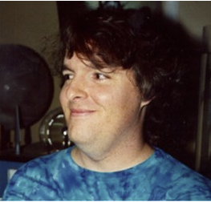
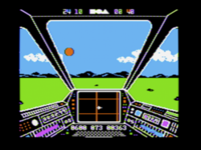
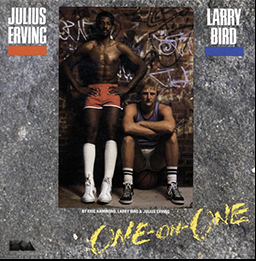

### What is a Software Artist?
 1. An artist, or small group, that uses software as a medium.
 2. [Trip Hawkins's 'big idea' that launched Electronic Arts](https://www.youtube.com/watch?v=b89-7msvlac target="_blank")
 3. The brilliant marketing campaign by Trip Hawkins, Bing Gordan and Richard Melmon at Electronic Arts in 1983 and brilliantly executed by Jeff Goodby and Andy Berlin as Goody Berlin and Silverstein's first [ad campaign](https://www.eurogamer.net/articles/2018-09-16-seeing-farther-the-advert-that-changed-the-games-industry) in 1983.
 3. A software engineer who works works as an individual, or small team, and strives to ship, but not maintain a program (a work).
 4. A programmer without a paycheck.

I have been all of the above times in my career.  In 1982 I met definitions 1 -3.  I was moonlighting, writing a game for the Atari 800, while working at Xerox PARC.  It was the first time I could afford to buy a computer, and therefore need not need patron to provide a computer.  This freed me to program something I wanted to see, rather than something my company wanted to sell, and to see what home computers were capable of.  I was incredibly lucky in that as I was looking for a publisher of my (very abstract) game Electronic Arts was just ramping up.  Trip had hired Tom Mott from Xerox to be the first VP of Engineering at Electronic Arts.   So I pitched the game to EA and we signed an publishing agreement.  They also offered me a job which I quickly accepted based on Trip's vision for the home computer.  I have always suspected that their agreement to publish my game was greatly influenced by their desire to hire me as an engineer.  By this lucky coincidence I became a "Software Artist" and got my fifteen minutes of fame through the Electronic Arts launch campaign. Which included this photo by world famous rock start photographer [Norman Seef](http://normanseeff.com/).

My time as a Software Artist was even shorter lived than my fifteen minutes of fame however. As soon as I signed the employment agreement with Electronic Arts I was no longer an artist, but an employee with tasks, management and schedules. One of the lesser known reasons for Electronic Arts success is that from the beginning they hired both computer scientists, and self-trained computer savants.  Talented computer scientists from Xerox also included Steve Hayes, Jerry Morrison, and Dan Silva. This allowed Electronic Arts to become a "value added" publisher which enabled independent software artist access to tools and processes developed internally.  My position as a technical director at Electronic Arts allowed me to work closely with some of the most talented Software Artists that helped launch the home computer entertainment market.  Daniel Berry Bunten and Ozark Softscape - [M.U.L.E.](https://www.filfre.net/2013/02/dan-bunten-and-m-u-l-e/) Seven Cities of Gold, Modem Wars. Eddie Dombrower - Earl Weaver Baseball. Ray Tobey - Skyfox, Bill Budge - [Pinball Construction Set](https://www.filfre.net/tag/pinball-construction-set/) and many others.

What is the difference between a software engineer and a software artist?  I define a "Software Artist" as an artist that uses software to create a work of art.  How is this any different than a Software Engineer?  The artist owns the project, and does all, or almost all, of the coding of the work.  The artist owns the all design decisions, the definition of the work, and the schedule.  The engineer typically works on a team implementing a project with a specification, schedules, and some form of project management.   The artist completes the work and publishes it.  The artist does not plan on modifying the published work. The engineer probably spends more time on modifying and maintaining the project than on it's creation.  Documentation and code readability are vital to an engineering team.  Continuous deployment with automated testing is the goal of the modern engineering team. The goal of the artist is to complete the work, to "put it in the can".  I plan to write about some of these amazing software artists that I got to work with at Electronic Arts.  On rare occasions I have also worked with software artists in corporate environments.  These were exceptional engineers that saw a need for a program and single handedly, usually without management's prior approval or knowledge implemented the program.  Examples are Dan Silva who did [Deluxe Paint[(https://en.wikipedia.org/wiki/Deluxe_Paint)] at Electronic Arts, and Bill Duvall who implemented the code edit features of Doug Engelbart's NLS system on the Alto computer at Xerox P.A.R.C.  Duvall's work also had the best name of any software product I have ever encountered. It was called ugh, which stood for "Uncommonly Good Hack". And it was! In fact it was a better code editor (in 1981) than I can find today! It used a mouse and [keyset](http://www.dougengelbart.org/content/view/273/309/) and structured editing.

### Tribute to Jim Nitchals
In this blog I want reminisce about some of the remarkable software artists, and software engineers I have had the pleasure of working with in my career.  In this first of a series I am going to highlight [Jim Nitchals](http://www.gamedesignersremembered.com/jim-nitchals/category/all), a brilliant, self-taught Apple II guru.  Tragically Jim died of a massive brain hemorrhage in 1998 at the age of 36.  R.I.P. Jim.

The link above is a nice Tribute to and Bio of Jim.  It covers his time before I knew him at Electronic Arts, and his time after Electronics Art as pioneering spam fighter.  However it does not cover his time at Electronic Arts where I got to know him well.  I will begin with a typical "Nitchals Story", of which there are many.
It was after midnight in the offices of Electronic Arts on Campus Drive in San Mateo.  The only two people in the building were Ray Tobey, an 18 year old Apple II prodigy, and software artist, working on his game Skyfox.
 
 Ray working on the art for Skyfox using one of the original Apple II graphics tablets.  Jim came into the room where Ray was working and listening to the radio.  Watching Ray work Jim noticed that every time Ray pressed the stylus onto the graphics tablet there was a click of static on the radio.  Jim didn't say anything about the static click, he just asked Ray if he had a manual for the tablet.  Ray had this manual which he handed to Jim who then left the room.   About an hour later Jim comes back into the development bullpen with a floppy disk.  He hand the disk to Ray and says, here boot this disk.   So Ray put it into the Apple II disk Drive and rebooted the Apple II.  To Ray's astonishment as soon as the disk booted, the radio started playing the Stars Bangled Banner! This amazing feat makes some sense when you realize that Jim is credited with the first in-game music on an Apple II with his [Microwave]("https://www.youtube.com/watch?v=8EXWxgmym0E) game.  The Apple II had no dedicated sound hardware. The only  means of controlling the audio was to write or read location 0xC030 which inverted the position (in/out) of the speaker cone. Repeatedly hitting this location at the correct times would produce a square wave.  Jim knew the cycle time of every 6502 instruction and interspersed speaker toggles in all the game loops that generated in game music inMicrowave.  I personally watched Jim write long routines in HEX without even the aide of an assembler.
 I can think of at least two instances where Jim's code literally save Electronic Arts.  The first was Jim's **Fat Track Loader**. This code was the "Copy Protection" for Electronic Arts C64 disk products.  The manufactured disks had a double wide, "fat track", written by special hardware at the disk duplication which was impossible to duplicate on consumer hardware.  However the code to check this signature and load the game was shipped on every disk. Jim's Fat Track Loader was so clever, so diabolical, and so obtuse that it was over a decade before a full explanation of how it worked was [published](https://c64preservation.com/files/EaLoader.txt).
  If any of you hackers out there spent far too many hours cursing at this screen, here is the reason why.  These are some notes from that explanation:
 ***
 Electronic Arts C64 Fat Track loader

This one is a monster… even more so when you take a look at the possibilities for games to check if they were loaded by the proper, unmodified loader.
It's pretty much all here: self-modifying code, P-code, encryption, checksumming, memory fills, everything.

The decryption routine uses multiple checksums of the loader code to come up with the decryption key.
Finally, memory from $0800 to $7EFF is decrypted.
Then a checksum is run over the resulting code, and compared to a value in the header.
If it is good, then the game's start address is decrypted and the game is started up.

Now, where is all of this decryption and fat track code hidden?
Inside a P-code interpreter.  The loader interleaves 6502 code with P-code, making it difficult to get a dump of either. Then a checksum is run over the resulting code, and compared to a value in the header.  If it is good, then the game's start address is decrypted and the game is started up.  The more sensitive the game is to the exact state of the machine at this point, the harder it is going to be to save off the game.  I/O registers are subtly tampered with.  Key values are written under the kernel.  Altering a single bit of memory in certain places causes decryption operations to go wildly awry.
***
Electronic Arts was essentially a struggling start up for the it's first six years.  The effectiveness of Jim's Fat Track Loader absolutely helped prevent loss of sales to software piracy and thus helped to Electronic Arts to survive.   Electronic Arts really started making money after it started making cartridges for the Sega Genesis machine in 1990.  Electronic Arts used a "clean-room" approach to reverse engineer the Sega Genesis machine which allowed it to allowed the company to make a sweetheart publishing deal with Sega.  Electronic Arts was the only publisher which was allowed to manufacture its own cartridges.  Jim played a vital, even key, role in this reverse engineering project.  What was remarkable was that Jim was on the "Clean Team" for this project.  The notion behind a clean room project is one team is "dirty" and examines the ROM hardware and disassembles system code. The dirty team then writes an English language version of this description of the machine and gives it to a legal team.  The legal team gives the English language description to the clean team and they then implement software for the machine.  IBM had recently won lost lawsuit against  Compaq Computers who they claimed had illegally reversed engineered the IBM BIOS Software.  Compaq had used a well documented clean room approach and won the case.  It was Trip Hawkin's brilliant plan to reverse engineer a Sega Genesis.  Then when Trip went to negotiate with Sega about a publishing license on Genesis platform he asked for what must have seemed like outrageous terms to SEGA.  They said no way.  Trip then threatened to publish on the platform without a license from SEGA.  They said that was impossible because Electronic Arts had never obtained a development nor development documentation from SEGA.   Trip said "Wanna bet?" and pulled a cartridge from his brief case, plugged it into a Genesis on the table and demoed an EA game.  He then explained how EA had used a clean room approach to reverse engineer the hardware.   This is called negotiating leverage.  SEGA and Electronics signed a publishing agreement that was very beneficial to both parties. The ironic part here is that most of the breakthroughs in the reverse engineering process came via Jim Nitchals experimentation with a consumer unit on the clean team, rather from the dirty team's deconstruction of the SEGA Genesis ROM software.

Jim also ported several existing EA titles to new platforms.  He excelled at this task.  When Jim was tasked with porting Dr. J and Larry Bird Go One-On-One from the Apple II to the IBM PC, Jim had to learn Intel 8086 assembly language and the IBM PC hardware.  Jim was not a fan of higher level operating systems, and in particular he was not a fan of DOS which he felt was bloated.  So he programmed Dr J. using ONLY IBM BIOS calls! He onCreateNode a bootable floppy that booted straight into the game, bypassing DOS all together! If you could find a modern IBM PC with a 5.25 floppy disk this game would still boot and run today!   Jim also did the copy protection loader for this game.  He knew that the standard process of pirates was to observe where the pirated copy of the software failed, and trace backwards from that point to find and disable the disk signature check.  So Jim created a truly diabolical scheme.  When his loader detected a pirated disk, Jim hooked a routine into the IBM's 18.2 hertz timer interrupt.   Every timer tick the routine would very slowly turn down the DMA refresh rate of the hardware. The DMA refresh rate was set to 15.04 microseconds (72 cycles) at boot-up on the original IBM PC. Soon the program would fail with a memory error, but it was totally unpredictable where and when the error would occur making it very difficult to trace execution back from the error.   Of course this crashed the entire machine, but hey, the machine was only running a bootable disk of a pirated game anyway.

Another bit of Nitchals' wisdom was evident whenever someone asked Jim to estimate how long a given project would take.   Jim would say "Show me the development environment". He would then take out stop watch and time the compile-edit-debug loop of an existing project in that environment.  He would multiply that time by 10,000 announcing "All projects take 10,000 builds".  His estimates were more accurate than most.  He also spent a lot of time optimizing the development tools including writing his own in memory cross-assemblers for various platforms.   After he left Electronic Arts Jim became a staunch opponent of spammers, creating the Forum for Responsible and Ethical Email organization.  I, being a recipient of the [world's first spam email](https://www.templetons.com/brad/spamreact.html), greatly appreciated  this work. Jim Nitchals was a genius.  R.I.P. Jim.
