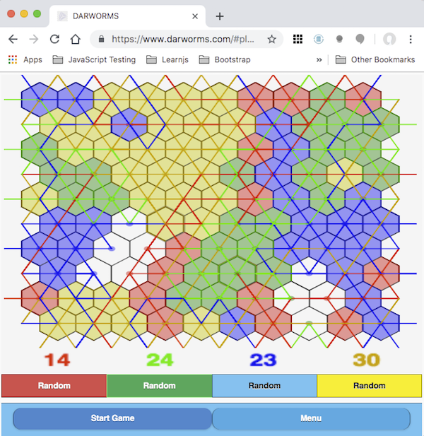

## What
I am launching [Darworms](https://darworms.com), a totally free web based port of the games [*Worms?*](https://en.wikipedia.org/wiki/Worms%3F) which I wrote in 1982 on an Atari 800.  Electronic Arts published *Worms?* in May of 1983 as one of the company's launch titles. Darworms is a one to four player strategy game of territory capture.

## Why?
Why would anyone want to spend time recreating a 36 year old video game that was a relative commercial flop when it shipped even with a massive Electronic Arts [ad campaign](https://www.eurogamer.net/articles/2018-09-16-seeing-farther-the-advert-that-changed-the-games-industry) behind the launch titles?
* For fun but, alas, probably *not* for profit
* I enjoy coding
* I retired in 2017.
* I want to learn front-end development, JavaScript (ES6), modern frontend development practices, HTML 5 and canvas graphics
* The existence of the browser platform which offers the potential of frictionless distribution to billions of people intrigues me.
* I wanted a project that might enable meaningful comparisons between the 1980's and now for software development, user platforms, software distribution, and software marketing.
* Even though I know the game will not appeal to all audiences, I also know from experience a small subset of the audience (hello geeks and nerds) will find the game fascinating.  The original *Worms?* had a small but dedicated cult following.
* I still find the game interesting.  For example even though the game is entirely deterministic, I have no idea whether the player who moves first in a two player game has an advantage.
* I want to compare and contrast independent game development in the 80's versus today.  Development tool and process, and distribution and marketing strategies.
* I want to see if a being "Software Artist" is a viable goal today. Is it possible for a one man shop to create, publish, distribute and market a casual game today.  Is it possible to make enough money to at least cover costs?

Please, if you like abstract strategy games.  check out [Darworms](https:www.darworms.com) and let me know what you think.  If you like it please share it. Thank you.

You can find a short [4 minute tutorial on YouTube](https://youtu.be/Uq3-C6aN-J0)

Are you interested in comparisons between the experience of being a Software Artist in 1982 versus today?  You can read my blog post [here](/software-artist-1982-vs-today/)
