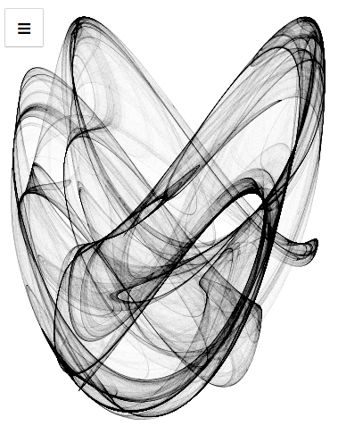
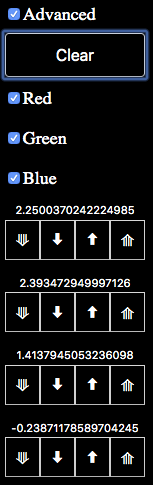
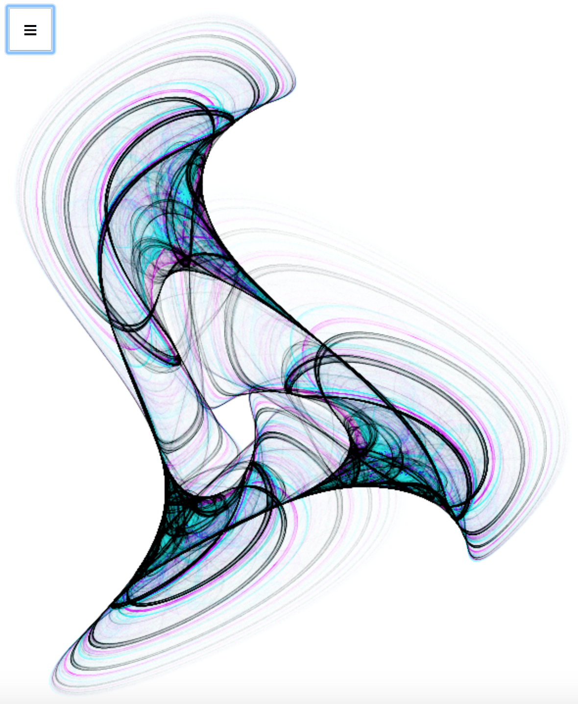
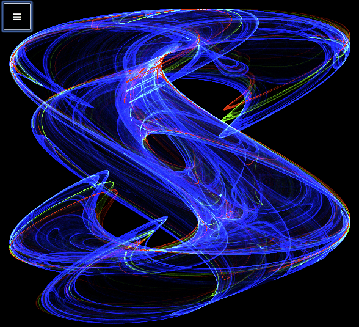

## Pickover's Chaotic Attractor


Here is my latest software art project: An implementation in JavaScript (ES6) of Clifford A. Pickover's classic chaotic attractor. [Try it here](https://chaosvue.netlify.com).  Watch as a beautiful picture, one that no one has ever seen before, fades slowly into view.

The image is generated by computing a histogram of the points visited in the image by continuously iterating a chaotic attractor in the browser's background.

Definition:
```
xn+1 = sin(b*yn) + c sin(b*xn)
yn+1 = sin(a*xn) + d cos(a*yn)
```
where a, b, c, d are variables that define each attractor.
For each new image the four variables are chosen at random. Next the point (x,y) is updated to a new point (xn, yn). This point in the image is made one point darker or lighter on a scale of [0, 255] = [pure black,  pure white]. The pixels are iterated continuously in this manner until 10% of the pixels touched have reached the maximum (or minimum) value.
#### Implementation Notes
I first saw images of Pickovers's chaotic attractor almost 30 years ago when I bought his book [Computers, pattern, chaos, and beauty: Graphics from an unseen world](https://www.amazon.com/s?k=Computers%2C+Pattern%2C+Chaos+and+Beauty+%3A+Graphics+from+an+Unseen+World).
In 1996 I implemented Pickover's chaotic attractor in C++ on an IBM PC to help me learn Windows 95 graphics and application programming. I shared the .exe file with several friends on 3.5" floppy disks. They enjoyed it.
Recently I was looking for a simple project to help me learn the [Vue.js](https:www.vuejs.org) framework and JavaScript bitmap programming. So I decided to implement it once again, this time as a web project using Vue.js. I am really enjoying the Vue.js framework, and the associated development environment. The best part is that now I can share my art project with the masses instead of with just a few friends.  If you enjoy [this art project](https://chaosvue/netlify.com) please help me grow the audience by sharing this link.

### Update December 17, 2019

For a long time I have been searching for an interesting way to add color to these chaotic attractor images. Just adding a color palette that maps a gray scale to a given color did not add that much interest to the images. I have recently discovered a more interesting way to add color to the images.  i have added an "Advanced" mode to the program.  When you select this Advanced mode you see several more control options for generating the images.

These controls allow you to both select the color component to increment when the attractor visits a pixel, and to tweak the four parameters of the chaotic attractor.  The parameters are display and you can directly edit the number and hit enter to change it. However what you actually want to do is just "tweak" one or more parameters a little bit.  The four buttons below each number do this. In order they reduce by 1%, reduce by 0.1%, increase by 0.1% and increase by 1%.  Experiment with changing colors, pausing, tweaking the parameters and resuming with different colors.  You can easily produces images like these:



If you have questions, or suggestions, or bug reports please don't hesitate to contact me.  The [Source code](https://github.com/dmaynard/chaosvue) can be found on github. It demonstrates how to combine a JavaScript Framework, Vue.js, with HTML5 Canvas graphics including pixel level image manipulation.  It also demonstrates the correct way to use JavaScript's requestAnimationFrame to perform animations in the browser background when the computing cycles for each frame can vary wildly from frame to frame. JavaScript garbage collection is my main suspect for the root cause to the variation in compute time required per animation frame. 
