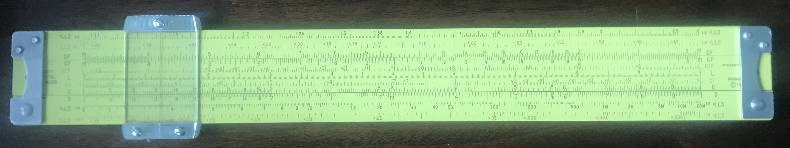
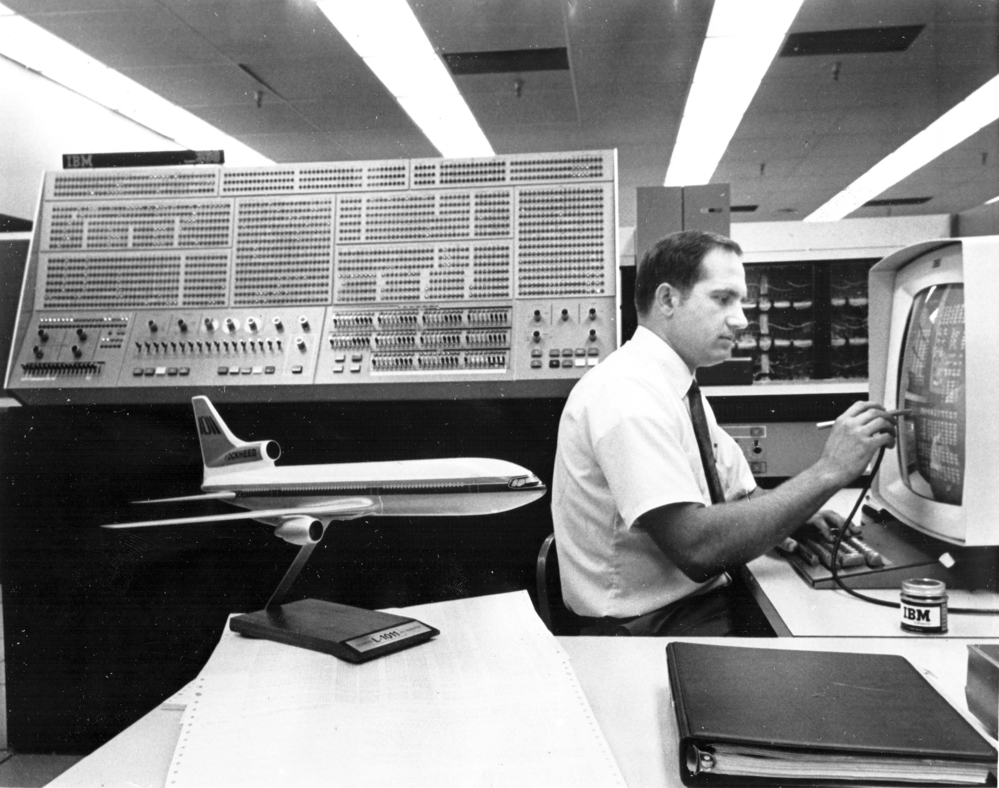
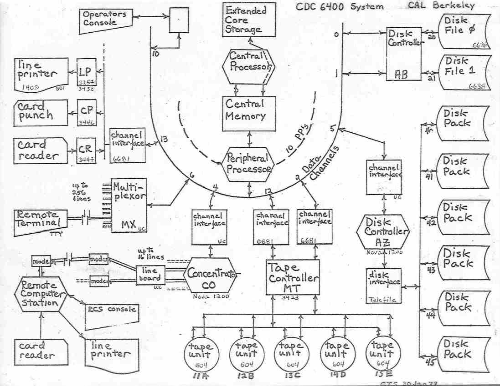
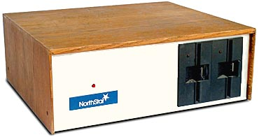
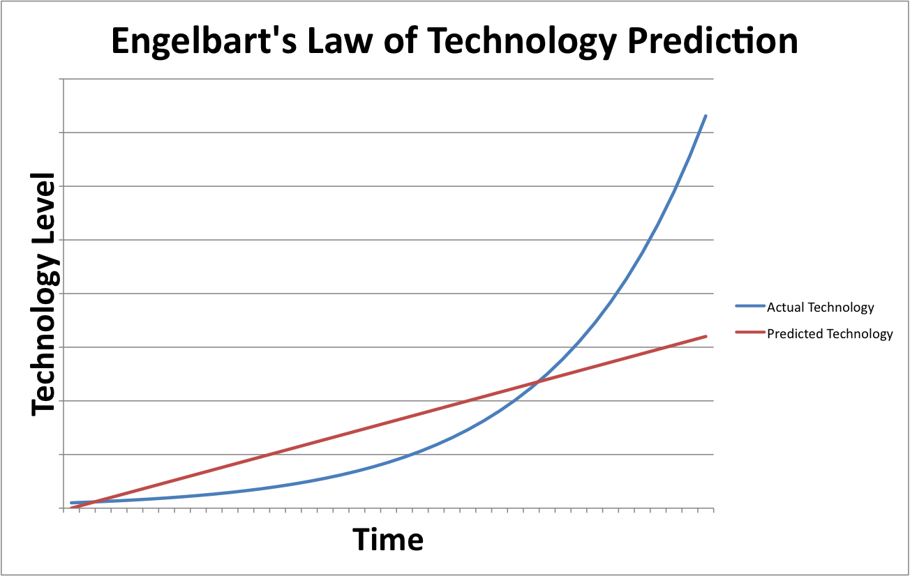

## Introduction
This is a brief history of my involvement with computers in general, and with computer gaming in particular. It is based on an interview I did with the Italian Media company [Storia de PC Gaming](https://storiadelpcgaming.it/) on January 5, 2021.
##  What was your first computer?
hmmm,  it depends on your definition of computer. I had an analog computing device when I entered college in 1965. A slide rule. To quote from the [Keuffel and Esser Instruction Manual (c) 1947](https://www.mccoys-kecatalogs.com/KEManuals/4168/4168_manual.pdf). "More and more today machines are doing the work which was carried laboriously in earlier periods by hand methods. One of the simplest of these modern instruments is the slide rule. Its great value consists in the fact that a large number of operations can be carried out on it in a fraction of the time required by other methods. the results obtained, being accurate approximately to three figures, are good enough for a great many purposes. The slide rule, perfected by three centuries of use, easy to understand, easy to operate, has come to be widely used in recent years and its popularity is increasing rapidly".  The slide rule could do multiplication, division, square roots, cube roots, reciprocals, and trigonometry functions. The Lockheed SR-71 Blackbird is an example of what a talented team of engineers could build [using slide rules as computing devices](https://militarymachine.com/sr-71-facts/#:~:text=The%20SR%2D71%20was%20built,of%20the%20middle%20'slide'). This was my first Slide Rule, a hand me down from my father who used it as an aeronautical engineer. 
A Pickett N4-ES Vector Log Log Dual-Based Speed Rule 1958-1959. State of the Art in personal compouting in 1958.

The first digital computer I spent a lot of time with was this one in the summer of 1968:

An IBM Model System 363 Model 91

Alas this was not actually my computer. It belonged the Lockheed California Company in Burbank, CA. So I didn't get to play any games on it. In fact I didn't get to run any programs on it at all.  I was a "computer operator". I was part of a five person (all men) team that kept the machine running smoothly. The 360/91 was a multi-million dollar machine and goal of the operations team was to keep the cpu busy 24 hours a day. I was on the grave-yard shift acting as a "go-for" for a million dollar machine.  We would load punched card decks into a reader on a front end machine (a 360/50). The front would read the JCL (Job Control Language ) for each job which described which 9-Track tapes were required to be mounted in tape drives and which disk 2314 disk packs needed to be installed in the disk, and what kind of output tapes were required, before the job could begin execution.  These instruction were printed on the operator terminal (an IBM Selectric Typewriter). The operators then prepared all the proper inputs and outputs and the operator told the front end 360?50 when everything was ready. the 360/50 was essentially just  scheduler for the single task operating system on the 360/91.  The goal was of course to always a have a backlog of jobs ready to execute because the 360/91 cost thousand of dollars per minute of cpu time. The CPU was about 16 MHz for adds, 5.5 MHz for multiplies, and 1.3 MHz for divides. It had 2 MB of main memory, core memory, meaning 2 million tiny ferrite doughnuts each hand threaded with three wires by cheap overseas labor.
The first computer I actually got to program was a CDC-6400 at Cal Berkeley.

One requirement for a Computer Science degree was a senior project.  I was taking aa Philosophy 101 course "Elemental Logic" to fulfill an elective requirement.   Being lazy I decide to combine this course with my senior project by writing a program to prove symbolic logic theorems.  I had just read about John McCarthy's LISP language and thought this would be perfect for the job.  So I bought a LISP 1.5 Programer's manual and discovered that even though Berkeley did not have a CDC-6400 Lisp implementation, the University of Texas at Austin did.  So I arranged to have a copy of the tape mailed to Berkeley Computer Center.  So as far as I know, I was the first person at Berkeley to program in LISP.  Programming in LISP on punched cards was hard. Turn around times ranged from one to 24 hours.  I learned a lot, about LISP, about recursion, about pure functions and about Symbolic Logic. In the end after many all nighters I got it work and passed both classes.  I credit this project, and my decision to learn a LISP with much of my later success as a software engineer.  Once you have programmed LISP on punched cards all other software development is easier by contrast.
So in 1969 I have a B.A. in Computer Science, have never owned a computer, and have never played a Computer Game.  In 1969 in the United States, studying a technical field in college provided males with a draft deferment.  Graduation ended this deferment, so my choices  were:
* Take a chance of getting drafted and being sent to Vietnam
* Move to Canada and renounce my US citizenship
* Try to convince the government I was a conscientious objector
* find a job that provided a draft deferment as a fringe benefit.

So I took a job working as a programmer for Lockheed, working on flight test data analysis.  I did this for three years, programming in Fortran IV.  I wrote the with pencil on paper on special forms which had 80 columns to model punch cards.  The forms were then sent to the "keypunch girls" to key into an IBM 029 keypunch machine, because of course men couldn't be expected to know how to type. This was three more years without owning a computer and without ever having played a computer game.

In 1972 I quit my job at Lockheed and moved back up to the Bay Area (soon to known as Silicon Valley).  I got a job at Stanford Research Institute (now SRI International)in Menlo Park, CA.  In 1977 I got my first almost personal computer.  Personal computers were still very expensive, several thousand dollars so I went together with three colleagues from SRI and we bought a S-100 bus Z-80 computer, a North Start Horizon with dual floppies and 32KB of RAM.
 This was really quite a nice computer for the time. It was one of the first PC's to include built in floppy drives. It had an s-100 bus with 10 sots. We also purchased a color video board and installed it.  It ran a version of the CPM Operating system and included a Basic compiler.  We didn't like Basic so we installed a UCSD Pascal and programed some graphic demos on Pascal.  Still no games, and the computer was really only one quarter mine.
##  What was the first game you ever played?
Galaxy Wars, a two player Space combat game. It ran on a PDP-1 and was installed in the Tressider Union Coffee shop on the campus of Stanford University in 1972.  Many claim this was the worlds first coin-op game.  There was always a line of people waiting to play.  Nolan Bushnell, Atari founder, built a clone of this game called SpaceWar. It was the very first commercially available coin-op arcade machine in 1972. The first prototype was installed in a local beer and burger joint in Menlo Park called "The Dutch Goose"

##  What was the first game that kept you playing for hours? What was special about it?
In 1978 I was working at Xerox PARC on a joint project with Fuji Xerox.  As a result I got to spend some time in Japan. I was there when Space Invaders was released and quickly became addicted along with a considerable percentage of Japanese youth.  It was an coin-op arcade game that cost 100 Yen, about $0.50 at the time.  100 Yen coins almost disappeared from the Japanese economy as the popularity of Space Invaders grew.  I got pretty good at Space Invaders in Japan.  A few months after I returned to the US, Space Invaders was launched in the US.  For about a short while I was a video game God. People lined up to watch me play.  It only lasted about a month however before people caught up and surpasses my skill level.
##  What was special about it?
The game play and the ever increasing tension as the invaders as the sound effects got faster and faster and each level progressed.  An interesting fact is that this speed increase was not intentionally designed into the game but instead resulted from the fact that the CPU always run full speed, but as the number of invaders decreased the frame rate therefore increased.  Serendipity in game design.
## In your opinion, what caused the 1983 Videogames’ crisis?
The best explanation I know of in the book recently published by a good friend of mine, Howard Scott Warshaw :  [Once upon Atari: How I made history by killing an industry](https://www.amazon.com/Once-Upon-Atari-history-industry/dp/0986218669/ref=sr_1_1) and no Howard didn't really kill the industry, but he did write the E.T. video game with a schedule of only 5 weeks from start to ship.  So corporate greed, management not understanding the new technology platform limitations. The Atari 2600 had only 128 bytes of RAM or scratch space, the call stack, and the state of the game environment. This led to a glut of games of less than stellar quality.

## As a child growing up, what did your bedroom look like? Were there any posters, gadgets or magazines?
No posters, but I did have a mural. My mother was a talented artist and in our dining room she had painted a beautiful mural of Portofino.  So I asked for a mural of a tropical island lagoon with palm trees and a volcano.  She obliged my wish.  As far as gadgets, I had a homemade skate board that was basically roller skate wheels nailed onto a wooden plank.  As far as magazines go, there were no video game magazines because there were no video games.  I have however,  had a subscription to Scientific American since i was 12 years old.  Over sixty years!
## Have you always been a video game player since you were a kid? How was the gaming culture back then?
No I didn't play my first video game until three years after I got my Computer Science degree and had been working professionally as a programmer.  There was no video game culture. Board games were popular, and I did enjoy playing Avon Hill's Gettysburg.
## Can you tell us about your work at the Stanford Research Institute (SRI) and your researches with Doug Engelbart to develop the first Mouse? What's the story behind those events?
Douglas Engelbart was a true visionary.  His idea was to free computing from merely being about number crunching and for it to become a tool for communications and information-retrieval. He wanted to turn Vannevar Bush's idea for a Memex machine into reality, where a machine used interactively by one person could "Augment" their intelligence. On December 9, 1968 Doug and his team gave a demonstration of his NLS system that has since come to be known as  [The Mother of All Demos](https://en.wikipedia.org/wiki/The_Mother_of_All_Demos). It demonstrated the mouse, the keyset, hypertext, windows, revision control, and a collaborative real-time editor with shared screen video. In 10968!  I joined the team in 1973 and worked as a systems programmer on the NLS system.  I learned many things from Doug. One thing I learned I call 
I also learned that being a visionary can be a very heavy burden to carry.  One example, the keyset.  Doug vision of text editing was that there are two distinct modes of working with text, text entry and text editing.  In the NLS system text entry was done with two hands on the keyboard.  Text editing however was done with your left hand on the keyset, and your right hand on the mouse. The keyset was like five piano keys, and you played chords to issue commands, and then you pointed at the arguments with the mouse.  He was correct. In fact because of the mouse and keyset the NLS system was the best code editor I have ever used.  For example suppose you have a code file with many functions.  You want to add a new function similar to an existing function.  In NLS you would load the file and hold down the left two mouse buttons and hit "b" on the keyset.  This changed our display view to be one line per function. All NLS files were strict hierarchies.  You now hit "c" on the keyset and the command line of the top of the screen echoes "Copy". Hit "b" on the keyset and the command changes to Copy Branch (from) you now point to the old function with the mouse. The command line now reads Copy Branch from (to) and you point to the desired location for the new function and press the mouse button.  When a user becomes proficient using the mouse and keyset it is like the coefficient of friction between the text and the display becomes zero.  It was truly a better text editor than I can find today.  The problem: It took a couple of days to learn how to use the keyset and memorize the commands.  That turned out be an unsurmountable consumer barrier. Sad. As Doug put it:  Steve Jobs did a user study and found out that it was easier to learn to ride a tricycle than it is to ride a 10 speed bike, and declared therefore from then on all people should ride tricycles.
Doug group at SRI was called the Augmentation Research Center or ARC. It pioneered using computer to "Augment" knowledge workers, and groups of knowledge workers.  It include hypertext, and the "Journal" where a document could be published and became immutable so that links would always work.  This group was a "super group" that just did whatever needed to be done. For example in 10969 there were no text display terminals to use as workstations. So the ARC invented them.  They built a character generator circuit that would display characters on a commercial Oscilloscope.  The then installed a rack of oscilloscopes in the machine room.  They then pointed a black and white TV camera at each oscilloscope.  In Each workstation then had a TV Monitor which displayed the dynamic text display and mouse cursor.

SRI also played a vital role in the development of the the ARPA net, which became the internet.  I worked with Jon Postel who authored a large percentage of the early ARPA Net  "RFCs" (Request for Comments), which defined the network protocols.  I also worked with Bill Duval who sent the first ARPA Net packet to from the SRI SDS 940 to the UCLA SDS Sigma 7 on October 29, 1969. EOL versus CR/LF

##	When did you fully understand the video game industry would have been your future?
I was working at Xerox PARC when the first port of Maze War was released for the Alto.  The Xerox Alto was the first personal computer with a bitmap display and a local area network.  A couple of interesting things happened.  Work almost stopped.  Programmers were playing maze war for hours.  Management was powerless to so anything about it.  Then because the Maze war sources were checked into the version control system programmers started making their own personal hacks (cheats) like God mode where they could see where all the players were in the maze.  This sort of ruined the game and that annoyed the developers, so they decided to encrypt the source files in the source control system.  This was XeroxStar PARC with all the crown jewels of computer networking and user interfaces, and the only source code that was encrypted were the maze War sources. That is when I realized the future was games.

## 8.	What can you tell us about your researches at Xerox Palo Alto Research Center? What were you working on and how significant was your research for the future of operating systems?

JDS Japanese Document system.  Build our own bitmapped fonts.  One display font was larger than the real memory on the Alto (256 KB). Dr. Joseph Becker.    Unicode.   JDS got rolled into the Xerox Star system.

## 12.	After the crisis, you embarked on a new adventure at Electronics Arts with Trip. What can you tell us about that period?

In 1982 I bought my very first personal computer, an Atari 800 with 48KB of RAM and two 90KB 5.25" floppy drives.  This was the first machine that was all mine. This meant that as a software artist I no longer needed a patron (corporation) to supply my artistic medium.  I know I didn't want to program in Basic, and I wasn't ready to make the jump to assembly language.  I found a open source implementation of the Forth language, figForth and started playing around with that.  I implemented Patterson's Worms in Forth to learn the Atari graphics system.  I then implemented a four player version, because the Atari 800 had four joystick ports.  Then I had the aha game design moment when I realized that awarding a point only to the player to lay the last line in a hex would give the game "all the strategic fascination of ancient games like chess and go"

It took me about six months to implement the game in my spare time at home in the evening and weekends.  It also took about six months to convince Xerox that it was mine, and not theirs.  I finally got a letter signed by a Xerox V.P. acknowledging the game belonged to me.  So I then started looking for a publisher.

By happy coincidence Trip Hawkins was just forming Electronic Arts and was looking for Software Artists, and also for software developers.  
