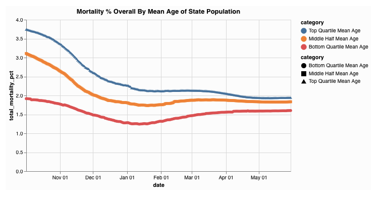
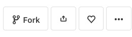
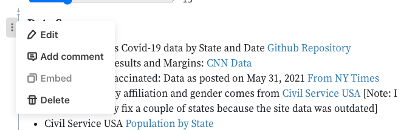
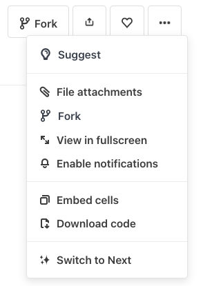
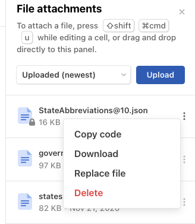
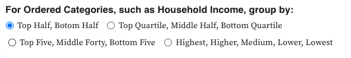
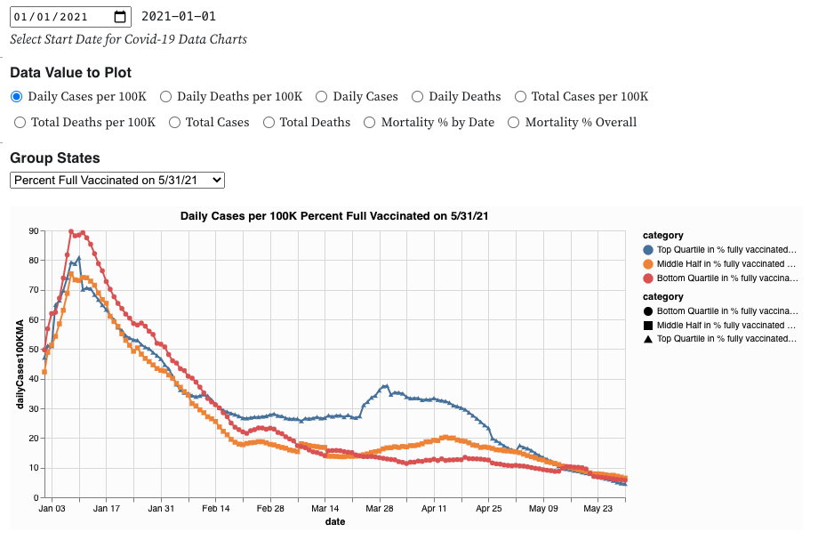
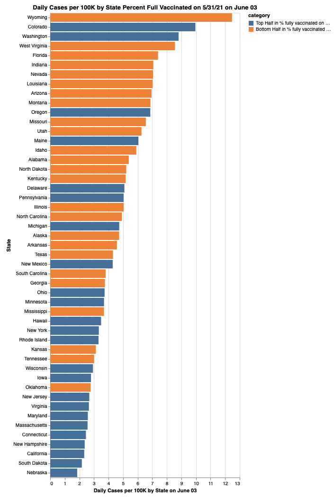

## Introduction

I love Observable. From their [documentation](https://observablehq.com/@observablehq/why-observable/2?collection=@observablehq/overview) "Observable helps you use data to think."

"Observable helps you explore and visualize data. It’s a platform to discover, to be inspired, and to accelerate your learning. You can share and publish your insights with the world. Above all, it’s a community of people helping each other learn and create together." 

I agree and wrote a Covid-19 dashboard to explore Covid-19 data. In my long career as a Computer Scientist I have learned that one good way to learn a new platform is to take an existing, real-world application on the platform and modify it.  I am writing this turorial on how to add new features to my covid dashboard for two reasons.  To help others learn how to use Observable and modify an Obervable notebook, and to make it easier for me the next time I want to add a new feature to my dashboard.

## A Practical Example in Observable
I have created a Covid-19 Dashboard using the amazing Observable framework [Covid-19 US States Explorer](https://observablehq.com/@dmaynard/covid-19-us-states-explorer). This interactive Observable Notebook allows you to explore a vast universe of over billion unique data visualizations of the Covid-19 pandemic by States and by Group of States.  For example you might want to ask how the mean age of a State's population affects the mortality rate from covid-19  This Observable Notebook includes all of the source code viewable and even editable.  The interactive data explorer is avaliable to anyone with a modern web browser, desktop or mobile, and an internet connection.  This Notebook combines static data for each state with dynamic data of history of Covid-19 cases and deaths for each state for each day since the beinining of the pandemic. The data is provided by the New York Times, and is updated daily.
## How To Add a New Category to the Visualizations
All the source code for the notebook is not only viewable, it is cloneable. Any user can 'fork' the notebook and to create their own copy that they can then modify.  I thought that some users might be interested in grouping states by some metric that I have not included.  This blog post will walk you through the steps needed to add a new category the the data visualizations. The first step is to make a private copy of the notebook so that you can edit the code. You do this my making a "fork" of the code. Note: you may have to create a free Observable account if you want to save your changes. Push the Fork button in the menu near the top right of the notebook home page.  
## Choose a New Category
The State categories are treated as static data by this notebook, in that they do not change day to day.  Examples are the population denity of a state, the mean household income of the state, or the percentage of black population of each state.  Note that the data isn't really static, it changes slowly over time, but the notebook selects a moment of time and treats the data at that moment as the static data for the state.  Some categories are not numbers, but rather have a set of possible values, such as whether the state was won by Biden or by Trumop in the 2020 pesidential election.   With an ever growing percentage of U.S. population receiving vaccinations against Covis-19 this seems like a good category to add to the visualizations.  Of course in data science nothing is simple. Do I count partially vaccinated people? What is a good reliable source for the data?  This data does in fact change daily, we will create a static data set by including the percentage the population fully vaccinated as of a certain fixed date.  For this example I am going to use the percent of people fully vaccinated as of May 31, 2021. I used this [New Your Times web site ](https://www.nytimes.com/interactive/2020/us/covid-19-vaccine-doses.html) as my data source.  So the first order of business is to update the Observable Notebook section "Data Sources",  Find the Observable cell "Data Sources" and hover over the left margin. A drop down menue will appear. Select edit. The editable source code for that cell will appear.  This particular cell contains markdown source code. We want to add the following markdown source somewhere in this cell definition 
```
* Percent Fully Vaccinated: Data as posted on May 31, 2021 [From NY Times](https://www.nytimes.com/interactive/2020/us/covid-19-vaccine-doses.html)
```
After you have made this edit, hit shift+return (or click on the right arrow) and Observable will recalculate the cell . The web page Data Sources section now includes the proper link to the New York times data page.
## Add the New State Data Manually.

Since there are only 50 States, and therefore only 50 data points for static State data, I find it is usually easier to manually add the new data points to an existing data file than to create a new file.  This also saves having to add code to read and parse the file.  A good file to use is  StateAbbreviations.json. This file contains several data items for each of the 50 states.  This file is a "File Attachment" used by this Observable Notebook.  You can download a copy of the file to your local machine so you can edit. Select the File Attachments submenu under the "..." button.
.  Then find the StateAbreviations file, press it's more button and download the file. 

Now edit the your local copy of the jSON file by adding the new data point for each state.  Here is one state, California, before 
```
{
  "data": [
      {
      "State": "California",
      "Abbrev": "Calif.",
      "Code": "CA",
      "MeanAge": 36.8,
      "PctHispanic": 39.1,
      "PctNHWhite": 37.0,
      "PctBlack": 5.5,
      "PctAsian": 14.4,
      "PctEvangelical": 20,
      "MaskOrder720": true,
      "MaskOrder321": true
      },
  ]
}

```
and after the manual edit
```
{
  "data": [
      {
      "State": "California",
      "Abbrev": "Calif.",
      "Code": "CA",
      "MeanAge": 36.8,
      "PctHispanic": 39.1,
      "PctNHWhite": 37.0,
      "PctBlack": 5.5,
      "PctAsian": 14.4,
      "PctEvangelical": 20,
      "MaskOrder720": true,
      "MaskOrder321": true,
      "PctVaccinated": 42.5
      },
  ]
}
```
## Upload the New Data File
After adding the new data value to each state, verify that the file is still vallid JSON format using any of the web based JSON validators.  A JSON error in this file will break almost everything in the notebook.  Once you have validated your new StateAbbreviations.json file you can use the file attachments menu again to "Replace File" and choose your edited version of the StateAbbreviations.json.  You should now reload the Notebook page and verify that everything is working as before.  Now we are going to add the code to allow the user to view various Covid-19 statistics, for example how new cases per 100k population varies over time for states that are in the top 5 of % vaccinated compared to the 5 states with the lowest % of population vaccinated (on May 31, 2021).  As I write this I do not know what the answer to this question is.  Hopefully by the time we get to the end exercise we will have visualizations of the data and we can begin our "lies, damn lies, and stattistics" and "Correlation is not causation" and "it's way too early for any herd immunity effects to show up in the data.  The good thing about this notebook is that it will update the data evvery day and we can watch how the statistics evolve and add these trend to our arsenal of support for our favorite hypothesis. 

## Extract and Sort 

Create a new Observable cell with the following devinition:
```
stateAbbreviationsByPctVaccinated = stateAbbreviations.data
  .map(r => ({
    State: r.State,
    PctVaccinated: r.PctVaccinated
  }))
  .sort((one, two) => two.PctVaccinated - one.PctVaccinated)
  ```
  This creates an array of 50 objects each with a text state name and a  numeric value. This array is sorted in descending order When you examine they array in Observable by pressing the down arrow you will see
  ```
  stateAbbreviationsByPctVaccinated = Array(50) [
  0: Object {State: "Vermont", PctVaccinated: 54.1}
  1: Object {State: "Maine", PctVaccinated: 54}
  2: Object {State: "Connecticut", PctVaccinated: 52.8}
  3: Object {State: "Massachusetts", PctVaccinated: 52.3}
  4: Object {State: "Rhode Island", PctVaccinated: 50.9}
  5: Object {State: "New Hampshire", PctVaccinated: 48.5}
  ...
  45: Object {State: "Georgia", PctVaccinated: 31}
  46: Object {State: "Louisiana", PctVaccinated: 30.9}
  47: Object {State: "Arkansas", PctVaccinated: 30.8}
  48: Object {State: "Alabama", PctVaccinated: 29.1}
  49: Object {State: "Mississippi", PctVaccinated: 27.1}
  ```
  ## Create Labels 

  We need labels for the charts for our new variable. This notebook has a function to generate chart labels based the value a a radio button the user chooses for how many catergories to divide the vakues into when aggregating state data togeteher. So add the following cell to the notebook.
  ```
  PctVaccinatedBucketNames = genNamesArray(" in % fully vaccinated on 5/31/21")
  ```
  Note that you can put this cell anywhere in the notebook. Order of cells doesn't matter in Observable. Obervable creates a dependency tree of all the cell and recompute each cell every time one of its depemdencies changes. You can see this by examing the cell 
  ```    
  PctVaccinatedBucketNames = Array(5) [
  0: "Highest in % fully vaccinated on 5/31/21"
  1: "High in % fully vaccinated on 5/31/21"
  2: "Average in % fully vaccinated on 5/31/21"
  3: "Low in % fully vaccinated on 5/31/21"
  4: "Lowest in % fully vaccinated on 5/31/21"
]
```
Now find the radio button and select "Top Half, Bottom Half"

Now look at the value of PctVaccinatedBucketNames.
```
PctVaccinatedBucketNames = Array(2) [
  0: "Top Half in % fully vaccinated on 5/31/21"
  1: "Bottom Half in % fully vaccinated on 5/31/21"
]
```
Pretty cool huh?  Your code is already responding to user inputs.  Next we have to merge the static State data 
## Add the new field to the stateGlobals array

Find the definition of the  stateGlobals array and add a entry for a new data field that we will call "pctVaccinated20210531" . Here is the first part of the editted cell
```
stateGlobals = statePopulations.data.map(e => ({
  ...e,
  pctVaccinated20210531:
    PctVaccinatedBucketNames[
      getCategoryIndex(
        stateAbbreviationsByPctVaccinated.findIndex(r => r.State === e.State)
      )
    ],
  governorsParty: governors.find(r => r.state_name === e.State).party,
  ```

  stateGlobals gathers together all the static classification data for the states from various data file attachments.  The code above adds a new field, "pctVaccinated20210531", to each State Object and sets its value to the appropriate PctVaccinatedBucketName based upon the state's ranking (0-49) in % of population fully vaccinated by finding that state's index in the sorted file stateAbbreviationsByPctVaccinated. 
  The mapping from index to name is controlled by the "group by" radio button as described above, which is in turn controlled by the followinhg json constant cell 
  ```
  rankingCategories = [
  [
    { low: 0, high: 24, label: "Top Half" },
    { low: 25, high: 49, label: "Bottom Half" }
  ],
  [
    { low: 0, high: 11, label: "Top Quartile" },
    { low: 12, high: 37, label: "Middle Half" },
    { low: 38, high: 49, label: "Bottom Quartile" }
  ],
  [
    { low: 0, high: 4, label: "Top Five" },
    { low: 5, high: 44, label: "Middle Forty" },
    { low: 45, high: 49, label: "Bottom Five" }
  ],
  [
    { low: 0, high: 9, label: "Highest" },
    { low: 10, high: 19, label: "High" },
    { low: 20, high: 29, label: "Average" },
    { low: 30, high: 39, label: "Low" },
    { low: 40, high: 49, label: "Lowest" }
  ]
]
```
Being Observable, you can edit this data structue if you want to add or modify how states are aggregated in to groups. 

## Adding your Group By Aggregator

The "Group States" pull down controls which aggregator function to use to create the charts. This pull down menu is controlled by another json constant array called "aggregateRadioButtonOptions". We need to edit this array to include the new aggregator
so add the new item in the array
```
aggregateRadioButtonOptions = [
  { label: "By 2020 Presidential Winner", value: "voted2020" },
  {
    label: "Percent Full Vaccinated on 5/31/21",
    value: "pctVaccinated20210531"
  },
  { label: "By 2020 Election Margin", value: "leans" },
  { label: "By Party of the State's Governor", value: "governorsParty" },
  { label: "By Whom the State Voted for in 2016", value: "votedFor" },
  { label: "By Gender of the State's Governor ", value: "governorsGender" },
  
  … more
  ```
  Now we have to add our aggregator to the json contant array "theAggregators"
  ```
  theAggregators = ({
  voted2020: genAggregator(voted2020Names, "voted2020"),
  pctVaccinated20210531: genAggregator(
    PctVaccinatedBucketNames,
    "pctVaccinated20210531"
  ),
  leans: genAggregator(leansNames, "leans"),
  more ...
  ```

Lastly we need to tell the graphic library what color scheme we want to use for the new charts. Add the following line to the array "theColorSchemes"
```
theColorSchemes = ({
  voted2020: {
    range: partyColors,
    domain: voted2020Names
  },
  pctVaccinated20210531: {
    range: tableau10,
    domain: PctVaccinatedBucketNames
  },
  more ...
```
Now you should be able to select charts based on the percentage of a states population that was fully vaccinated as of May 31, 2021. for example: 

And


These charts only present data. There is no political agenda or desire to convince anyone of anything.  The charts are dependent on the data sources and the code and the user choices.  However the notebook is cabable of generating over 2 quadrillion different disctinct charts you can probly find a chart to support almost any argument want to make about the Covid-19 Pandemic.   Correlation is not causation. Tracking real data over time can provide insights. Happy data explorations.

I hope this tutorial gives you a good idea of the power and elegance of Observable.  Feedbak is welcomed.


