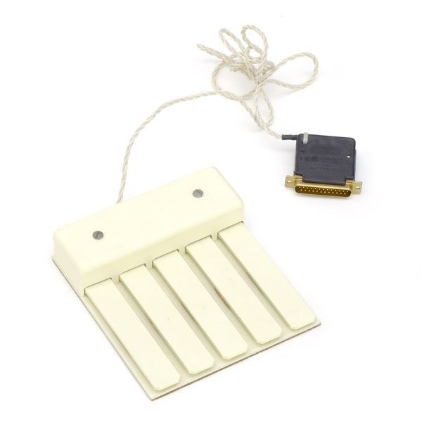
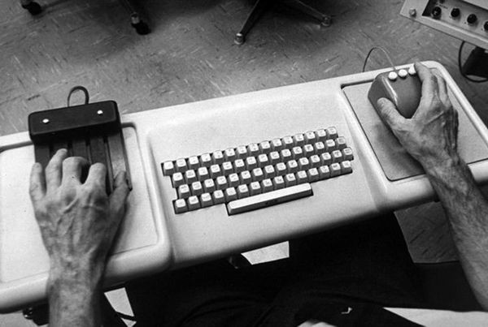
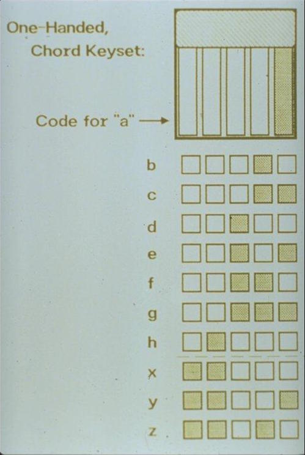
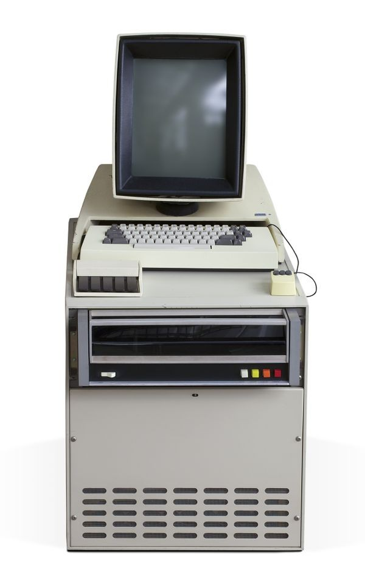
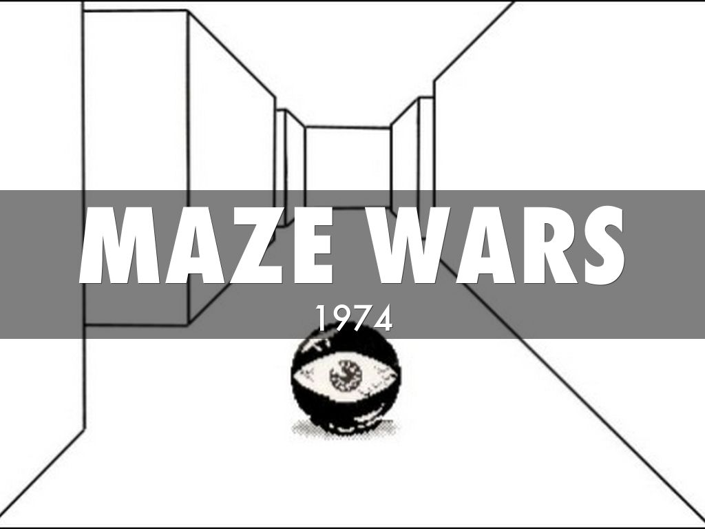

# The 150 year old device that made a 50 year old Integrated Development Environment (IDE) rock

| |
| :--: |
|  Engelbart keyset: One handed chorded keyboard  |
|  Photograph @Richard Mark courtesy of Computer History Museum  |

I have been coding for more than 50 years. I am retired now, but still enjoy coding and learning. I have programmed for mainframes, 8-bit cpus, home computers, servers, mobile devices and modern development laptops. I have used more than 30 different programming languages professionally. Fifty years ago I was using one of the best code editors I have ever used. This was the NLS (oNline system) in Doug Engelbart's Augmentation Research Center at Stanford Research Institute in Menlo Park California in 1972. NLS was running on a 1 MHz PDP-10 with 1 MB of memory (real+virtual combined). How is it possible that a fifty year old software system was, in many ways, a faster, more efficient code editor that I can find today?  It was made possible by the visionary genius of Doug Engelbart and the high performance user interface that he and his team built. One of the key innovations that enabled this performance was use of a mouse and keyset together to control the user interface.  Doug and William K. English invented the mouse and re-invented the keyset.  SRI applied for patents on both the mouse and the keyset. They received a patent on the mouse and found out that the keyset was patented in the 1860's as a telegraph input device.  The keyset is a five key keyboard on which the user plays keys, and/or chords, to type commands to the modal user interface. "c" was for copy, "d" for delete, "i" for insert etc. The keyset was not intended to replace the keyboard, since it is much faster to type with both hands on a keyboard. Therefore text entry should be with two hands on the keyboard. Touch typists utilize muscle memory to minimize the amount of mental focus needed to accomplish the physical task of entering the text. Touch typing on the keyset (chording), while mousing. enabled the same kind of muscle memory for simple edits, short text entry, and exploring a hyper-linked information space. You never had to take your eyes of the dynamic view of the information space. NLS was used to edit its own hyper-linked source code inventing software bootstrapping in the 1960's.  NLS demonstrated that text editing is more efficient with one hand on a keyset and the other on a mouse. The major attributes of NLS that contributed to its efficiency as a code editor were:
- a consistent verb > noun command structure.
  - verbs: copy, insert, delete, jump, transpose etc.
  - nouns: word, statement, branch, link, group, etc.
- keyset: give command verbs (chord C for C(opy) then S for S(tatement) or J(ump) L(ink) etc)
- mouse: point at nouns
    - number of selections determined by command type
        - copy takes two selection source, and dest
        - delete and jump take one click
    - selection is optimized for the noun type
        - branch and link take one click
        - text and group take two clicks
- strictly hierarchical file system
- viewspecs: keyset commands can fold and expand hierarchical views of files.

As a system programmer on the NLS system I used NLS to explore and edit the NLS source files. Doug was a big believer in bootstrapping so from the beginning the first "knowledge workers" to be augmented by NLS were in fact the programmers creating NLS. How effective was this? Take a look below at the list of firsts this relatively small group of programmers created.  Here is what the keyboard looked like.  Notice the lack of a row of function keys. 

|  |
| :--: |
|  Keyset Keyboard and mouse for NLS in 1968   |
|  Image courtesy of SRI International © SRI International  |

Using this setup I explored all of the NLS source code and how it was interconnected without ever touching the keyboard. If conditions were right, namely it was late at night and there weren't many people using the system (load average was under 2 on the PDP-10), flying through the information space of the NLS system was almost magical. It was like the coefficient of sliding friction between the text and the display was zero. If, for example, I wanted to add a new command to the system I would start by finding the source for an existing command that was most similar to the proposed command. I could filter my view of this file by using viewspecs. This is done by holding down a mouse button and typing a new viewspec on the keyset. Viewspec  'x' gave you only the top level of the hierarchy and only one line of text for each statement. As a result I would be looking at a list of all the procedures in this source file. I would find the one I wanted and then hit type 'cb' on the keyset. The command line feedback becomes "Copy Branch from", I select the procedure, and the command line feed back becomes "To" and I select where I want the procedure to be copied to. The command line feedback becomes "OK?" and a mouse click completes the copy. Now I hit "rw" on the keyset and the command line becomes "Replace Word at", I select the procedure name in the newly copied branch with one mouse click, the command line feedback becomes "by" and I type in the new command name either on the keyboard or the mouse. This entire sequence took less than a couple of seconds, and I never had to take my focus off of the source code file. I never had to move the mouse to a menu and then back to the source file.  Keeping focus on the code made allowed the engineers to get into and stay "in the flow" longer. Yes, you had to learn the chords on the keyset to type the single letters for the command, and you had to know the names of the verbs and nouns in editor. However once you mastered these navigating and exploring the information space represented by the source code became almost automatic, like text input becomes subconscious for a touch typist.  The keyset and mouse together gave the expert user that kind of muscle memory almost subconscious navigation and editing.  You used both hands to drive but you never had to take your eyes of the road. Your focus was on the information content, and not any action buttons, or pull down menus.
## Keyset Learning Curve: A Barrier to Entry

In order to become expert NLS user one had to learn how to type commands (characters) on the keyset. This was not that hard. It was much, much easier than learning to touch type. It took me maybe two days to become a proficient keyset touch typist.  In fact I became a one handed touch typist long before I became a two handed touch typist. It saddens me greatly that greatly that this learning curve proved to be one major barrier to commercial adoption.  As Engelbart once put it "Steve Jobs did a user study and found out it was easier to learn how to ride a tricycle than a 10-speed bike and declared that therefore all people should ride tricycles."  There should be a keyset in your left hand anytime there is a mouse is in your right hand.

The chording on the keyset used a binary encoding to map chord to letters.  This binary encoding made it easier to learn the keyset if you were familiar with binary arithmetic. If you knew the code for 'x' then you knew knew that 'y' was 'x" plus 1 or 'x' and 'a'. 
## Keyset: Necessary but not sufficient for high performance editor UI

The keyset was not the only, or even the must innovative of the visionary concepts of NLS. All of the features of NLS were in support of Engelbart's goal of augmenting collective knowledge work and therefore focused on making the user more powerful, not simply on making the system easier to use. If you haven't seem the video of Engelbart's 1968 demonstration (later to become known as "The Mother of All Demos") you should check out [The Mother of All Demos](https://www.youtube.com/watch?v=yJDv-zdhzMY) . You will be disappointed by how blurry the display terminals appear. This demo happened in 1968! Computers were mainframes and read punched cards and printed fanfold paper.  There was no such thing as a character terminal. So Engelbart's group hacked display terminals together by using a hardware character generator attached to an oscilloscope. They then pointed a closed circuit TV camera at the oscilloscope and the workstation display was a TV monitor.

 [Here is a list from Wikipedia of the NLS innovations over the years](https://en.wikipedia.org/wiki/NLS_(computer_system))
- The computer mouse
- 2-dimensional display editing
- In-file object addressing, linking
- Hypermedia
- Outline processing
- Flexible view control
- Multiple windows
- Cross-file editing
- Integrated hypermedia email
- Hypermedia publishing
- Document version control
- Shared-screen teleconferencing
- Computer-aided meetings
- Formatting directives
- Context-sensitive help
- Universal "user interface" front-end module
- Multi-tool integration
- Grammar-driven command language interpreter
- Protocols for virtual terminals
- Remote procedure call protocols
- Compilable "Command Meta Language"

*"Talent hits a target no one else can hit; Genius hits a target no one else can see."* -Arthur Schopenhauer. Doug Engelbart was a visionary and a genius. His mouse patent, granted in 1967, expired after 17 years in 1984, the year the Apple first shipped the Mac. 
## The keyset takes a dead-end side trip to Xerox PARC

|  |
| :--: |
| Xerox PARC Alto with mouse and chorded keyset. 1973 |
| Courtesy of [Computer History Museum](https://www.computerhistory.org/revolution/input-output/14/347) © Mark Richards |

When Chuck Thacker designed the Alto computer at Xerox PARC, the computer with a bitmapped display and a local area network, he included both a mouse and keyset in the design.  This was probably due to the number of software engineers that moved from SRI to Xerox PARC when NLS funding started to decline. This include William English, co-inventor of the mouse along with Bill Duvall, Donald (Smokey) Wallace, Charles Irby, James White, Larry Garlick and others. Most of the software written for the Alto used the mouse only and not the keyset. This was, I believe, due to the belief that the new medium (Interactive computers) should emulate the old medium (the printed page). Thus WYSIWYG (What you see is what you get) became a major design paradigm rather than Engelbart's vision of a new media of hyper-linked multimedia. Ironically this  vision-virus escaped from the PARC Lab through [Steve Jobs](https://en.wikipedia.org/wiki/Steve_Jobs) to Apple and via [Charles Simonyi](https://en.wikipedia.org/wiki/Charles_Simonyi) to Microsoft.  The program that generated the most use of the keyset at Xerox PARC was a port of [Maze War](https://en.wikipedia.org/wiki/Maze_War) to the alto, but that is another story.  

## Back to the Future?
I write about the keyset because I feel its importance is often overlooked when people discuss Engelbart's work. It would be possible to write a modal editor plug-in in VS Code that implemented the NLS verb noun matrix. There are some existing one hand chorded input devices, but none as simple and elegant as the keyset. It would be possible 3-D print the keys and add a Raspberry pi with usb output.  If one could only convince programmers to learn the keyset and editor commands their productivity would increase dramatically.  Alas, I am too old to be tilting at these windmills. However if some young ambitious software engineer wants to pick up this gauntlet there is tremendous potential for extending [Doug Engelbart's unfinished revolution](https://www.technologyreview.com/2013/07/23/177246/douglas-engelbarts-unfinished-revolution/).